Getting started with VSTS and IBM Cloud Private
----

I recently had a customer ask if ICP was supported using the Microsoft VSTS CI/CD pipeline.  I honestly didn't know as I hadn't used it before.  I generally am a Java developer and work with Jenkins for my CI/CD needs. But I was up to the task, so I thought I'd give it a try. The customer referenced a document which described how to do this using RedHat openshift, and I've
yet to find anything that can be done on Openshift that can't be done on IBM Cloud Private.
https://blogs.msdn.microsoft.com/najib/2018/01/03/setting-up-cicd-targeting-red-hat-openshift-kubernetes-using-vsts/

I think the versions are different and I'm using a Mac, but I was able to get it to work.  Here are the modified steps for my environment.

I'm starting from scratch and I have limited knowledge of Visual Studio and VSTS, so forgive me if I do anything non-optimally, but in the end I got it working, and in very little time too.

Ok here we go

Steps:

1) Install Visual Studio for Mac (Community edition)
2) Create my first project
3) Connect my project to Github
4) Build my project using Docker
5) Build my project using VSTS and publish on DockerHub
6) Connect VSTS to my ICP environment
7) Deploy project to ICP
8) Test and you're done!

---

1) Install Visual Studio for Mac
--
- I Installed Visual Studio for Mac from this link.  <https://visualstudio.microsoft.com/downloads>
- Follow the steps, takes a while

2) Create my first project
---
- Select File --> New Project
- Select type .NET Core --> App --> ASP.NET Core Web App
- Select Next
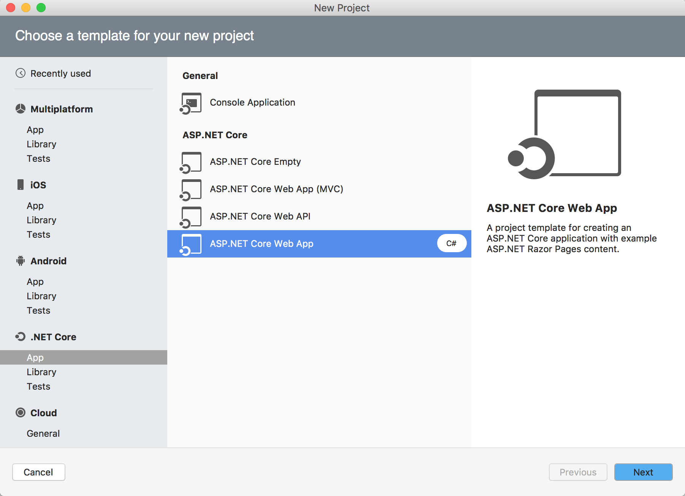
- Specify Project Name: `helloWorld`
- Specify Solution Name: `helloWorld`
- Specify Location: `/User/<username>/Projects`
- Check `User git for version control`
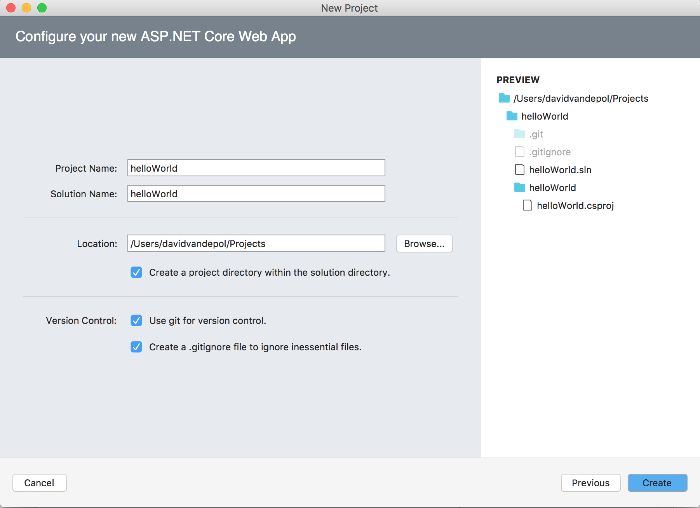

3) Connect Project to github.
---
- I'm sure there's a prettier way to connect things to github, but this is what I figured out.
- go to github and create a new empty repository
  - Do not intialize with README
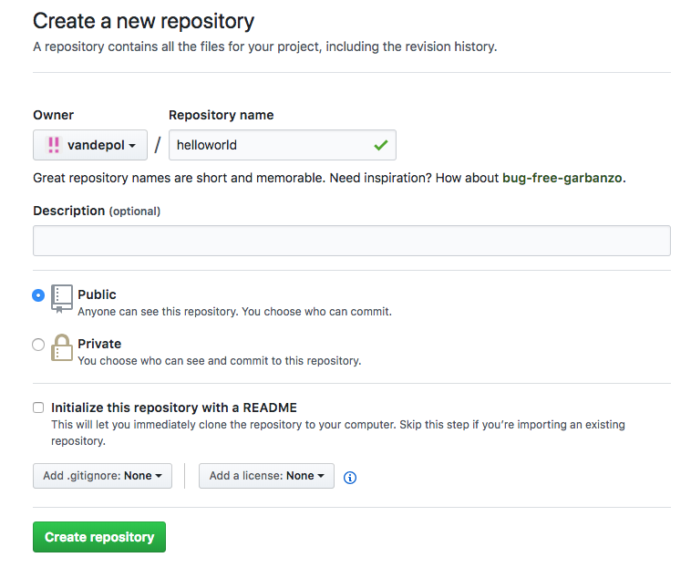
- Run the following commands to push your changes to github.  Of course change values to match your specific environment.
  `cd /Users/davidvandepol/Projects/helloWorld`
  `git init`  
  `git add .`  
  `git commit -m "Initial Commit"`  
  `git remote add origin https://github.com/vandepol/helloworld`  
  `git remote -v`   
  `git push -u origin master`
- You should now have your files on github.com

4) Build project using Docker
---
- To add docker support, right click the project and select Add --> Add Docker Support
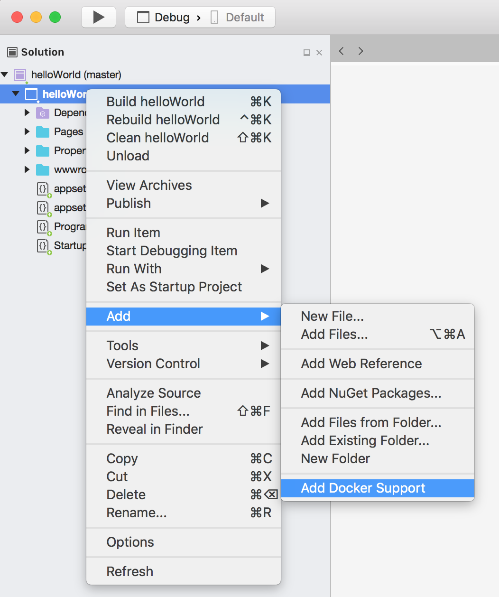
- This will create a Dockerfile, as well as create a docker-compose project.
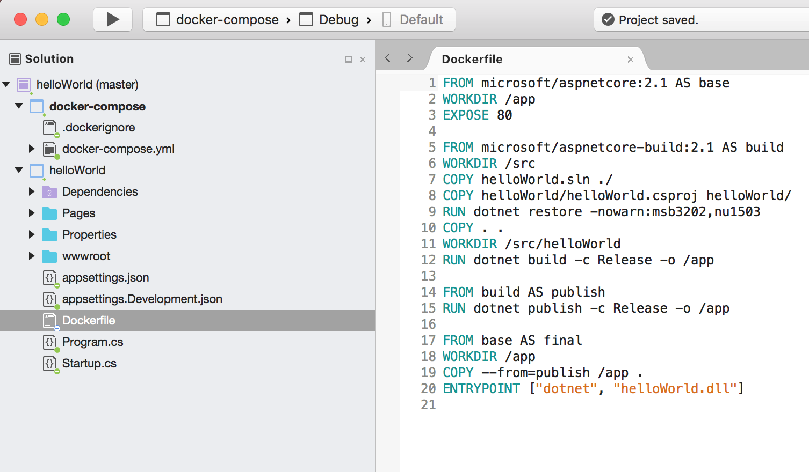
- As of today (July 12, 2018), the Dockerfile generated doesn't work...the docker images it references don't exist in the location specified.  To get this to work I modified a few lines.
  - Line 1 changed to `FROM microsoft/dotnet:2.1-aspnetcore-runtime AS base`
  - Line 5 changed to `FROM microsoft/dotnet:2.1-sdk AS build`
  - Line 9 deleted/commented out `#RUN dotnet restore -nowarn:msb3202,nu1503`
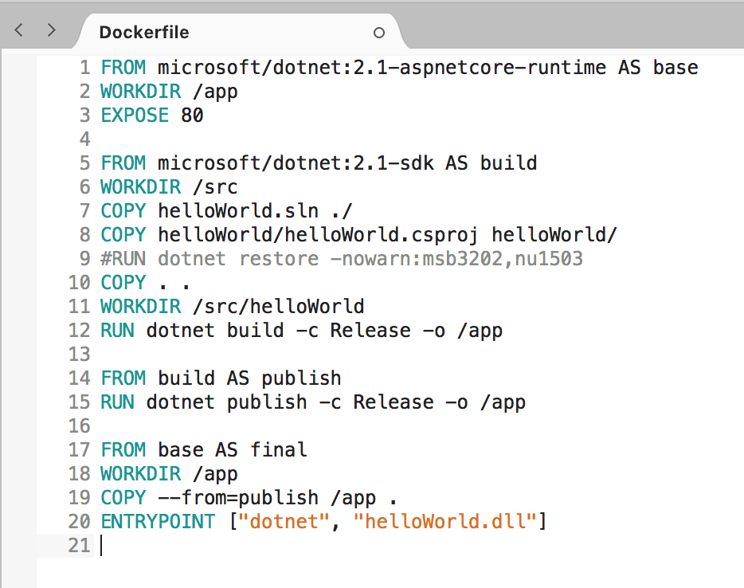

- To build the project, and run it in docker, click the Play button.
- 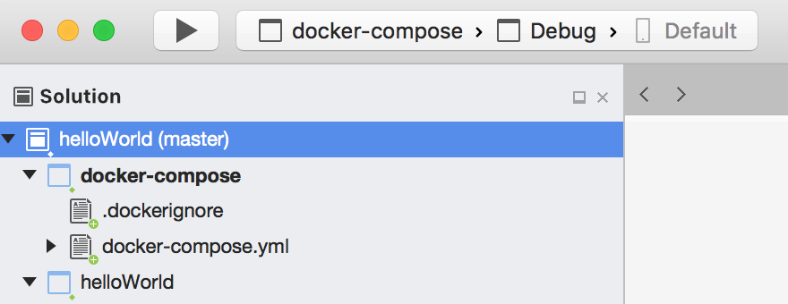

If all is well, your webpage should appear in your browser.

- 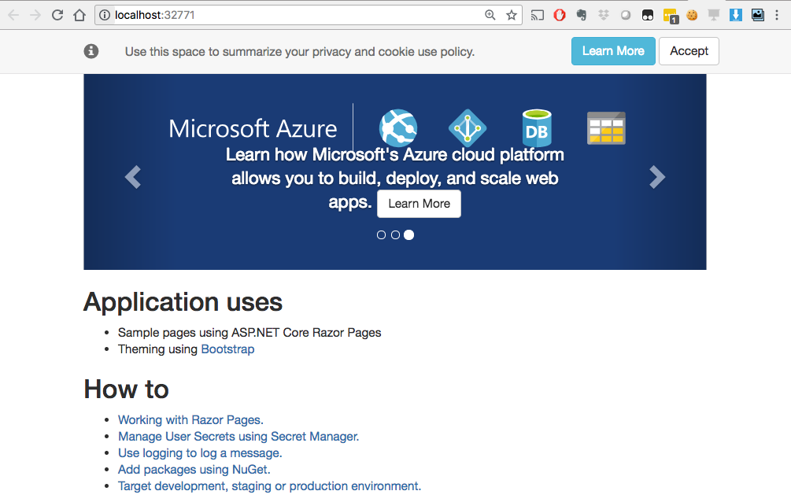

You can also view the application running in Docker.
Run the command `docker ps`
- 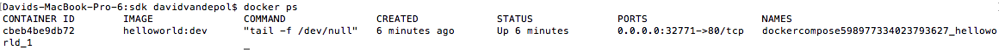

Now we need to checkin the changes we made into github.  You can do this through the command line or through Visual Studio.
`git add .`  
`git commit -m "Add Docker support"`  
`git push -u origin master`  


Ok if you know Visual Studio, then this has all been pretty boring for you.  Now on to the VSTS stuff

5) Build my project using VSTS
--
I created a new workspace by loggin in with my microsoft ID the Visual Studio Team Services
<https://visualstudio.microsoft.com/team-services/>


I logged in with my microsoft ID and password and went through the initialization wizard.

Once everything is configured through the wizard, start by selecting `+ Create Project`

- Fill in the information for the new project
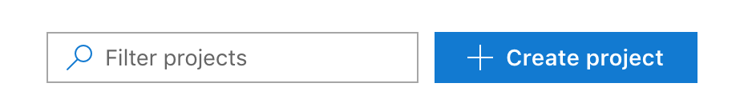

- On the getting started page, select the last option `or build code from an external repository` and click `Setup Build`

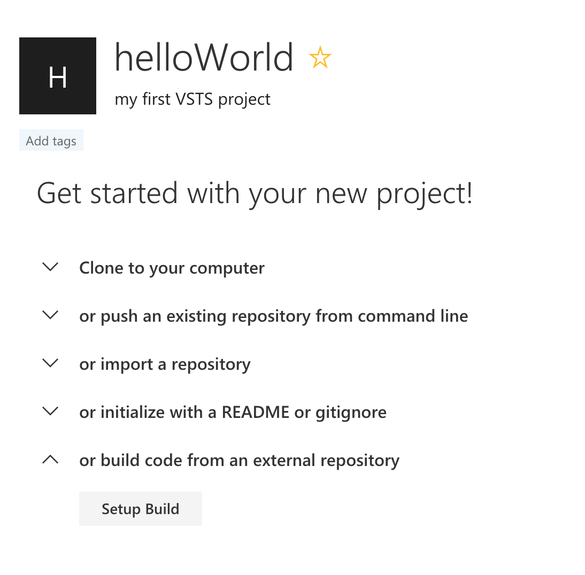

- On the Select a source page, select GitHub, give it a unique connection Name and click `Authorize using OAuth`.
- Follow the prompts to give authorization.
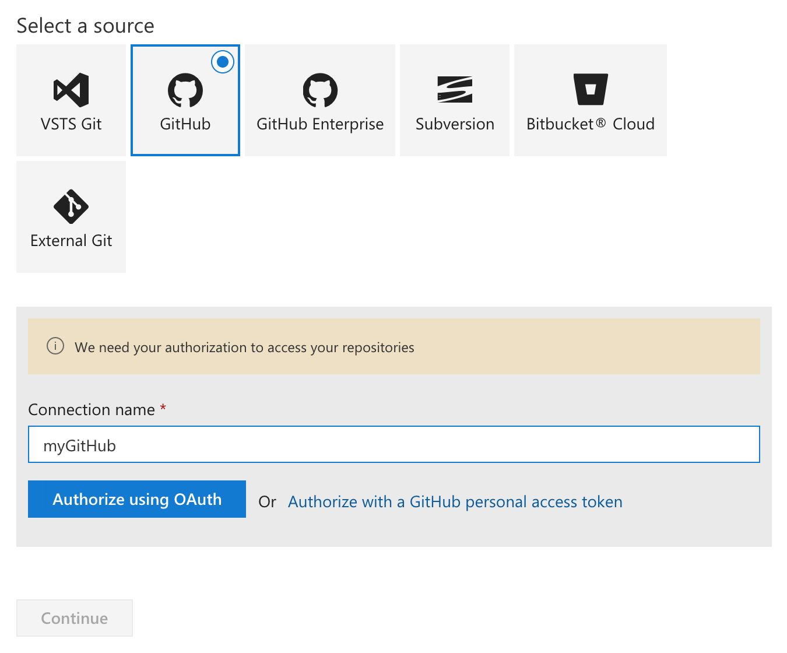

- Once authenticated, specify values for:  
 <b>Repository</b> : `vandepol/helloworld`  
 <b>Default branch for manual and scheduled build</b>: `master`
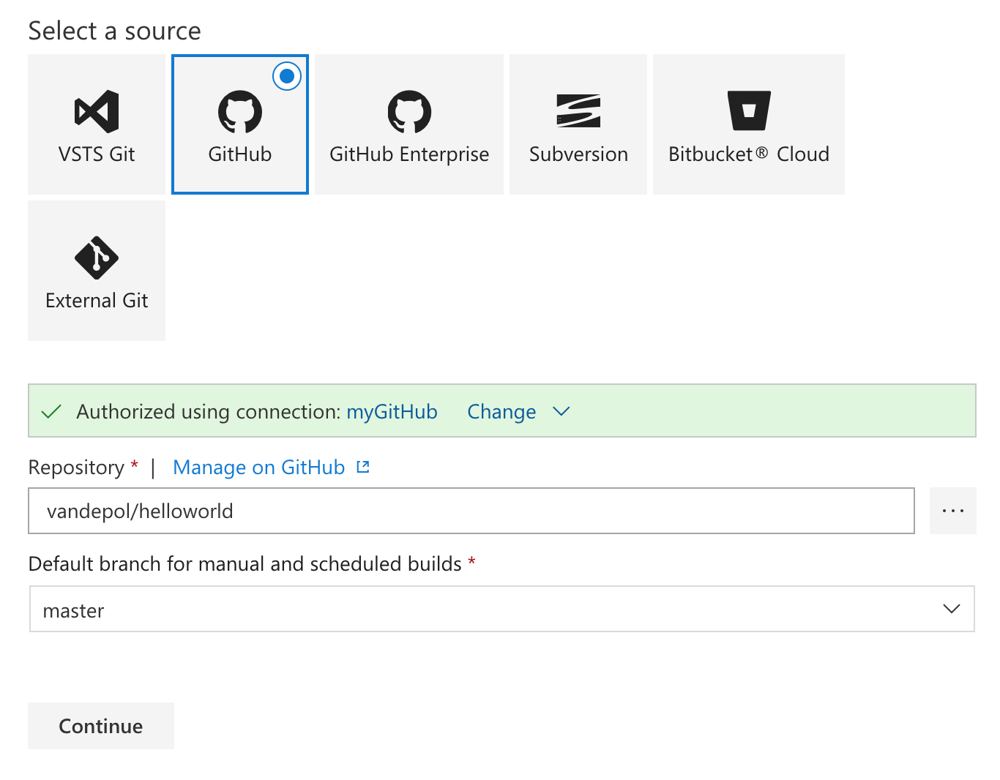


- On the Select a template page, select <b>Docker container</b> and click <b>Apply</b>
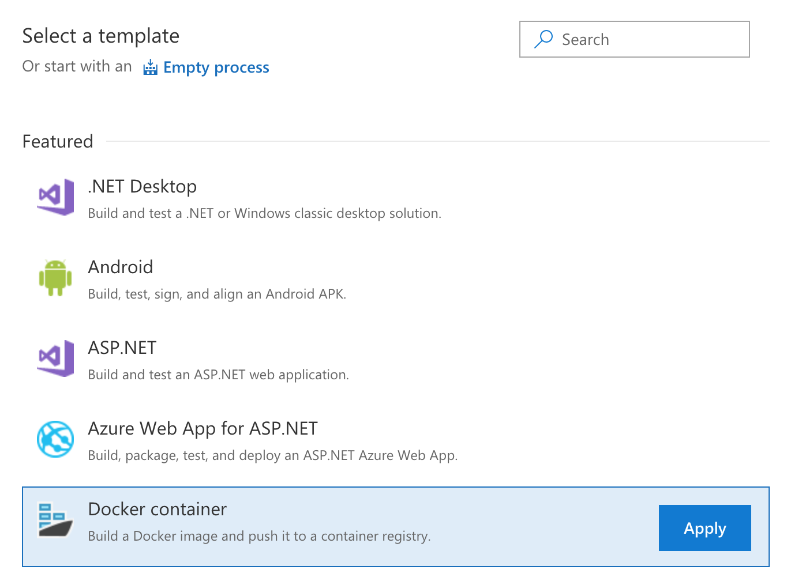

- Select `Build an image` and change the configuration as follows
  - Display name: Build helloworld image
  - Container Registry Type: Container Registry
  - Docker Registry Connection:
    - Click `+ New` - Popup will appear
    - Registry Type: `Docker Hub`
    - Connection name: `DockerHub`
    - Docker Registry: `https://index.docker.io/v1/`
    - Docker ID: `<your docker ID>`
    - Password: ``<your docker password>``
    - Email: `your email`
    - Select <b>Verify Connection</b> to see if connection is working
    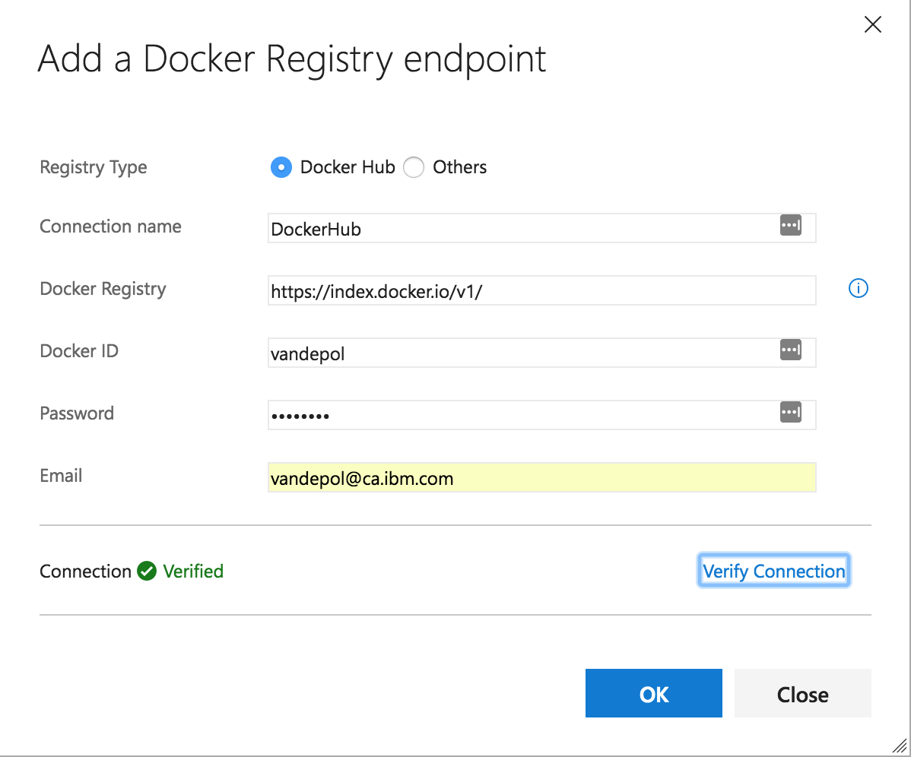
  - Docker File: `helloWorld/Dockerfile`
  - Build Arguments: LEAVE EMPTY
  - ***IMPORTANT*** `un-check` Use Default Build Context
  - Image Context: `.`
  - Image Name: ``$(Build.Repository.Name):$(Build.BuildId)``
  - The rest leave as default
  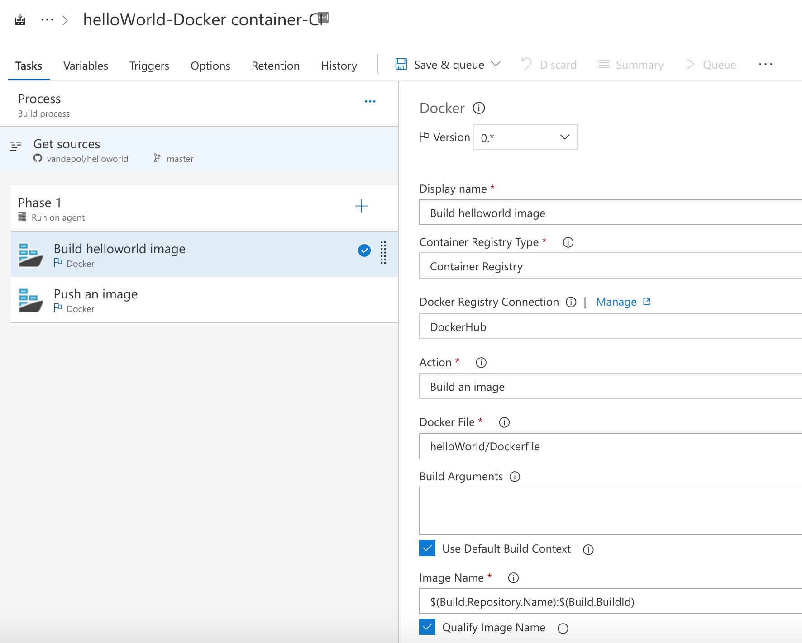

- Select Push an image
  - Display name: `Build helloworld image`
  - Container Registry Type: `Container Registry`
  - Docker Registry Connection: `DockerHub` (Created above)
  - Action: `Push an image`
  - Image Name: `$(Build.Repository.Name):$(Build.BuildId)`
  - The rest leave as default

- Move the yml files to artifacts directory so they can be accessed after the build completes.
  -  On the Phase 1 page select the `+` to add another task to the process
  - Select <b>Copy Files</b> from the task list
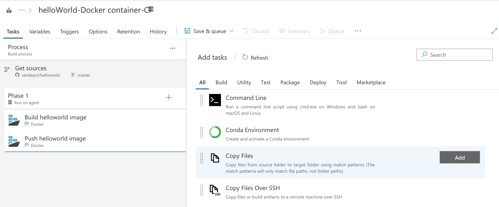
  - Click `Add`
  - Configure Copy File to with the following information
    - Display Name: `Copy Files to`
    - Source Folder: `$(Build.SourcesDirectory)`
    - Contents: `**/*.yml`
    - Target Folder: `$(Build.ArtifactStagingDirectory)`
- Copy the yml files to the drop directory
  - On the Phase 1 page select the `+` to add another task to the process
  - Select <b>Publish Build Artifacts</b>
  - Leave all values as default.
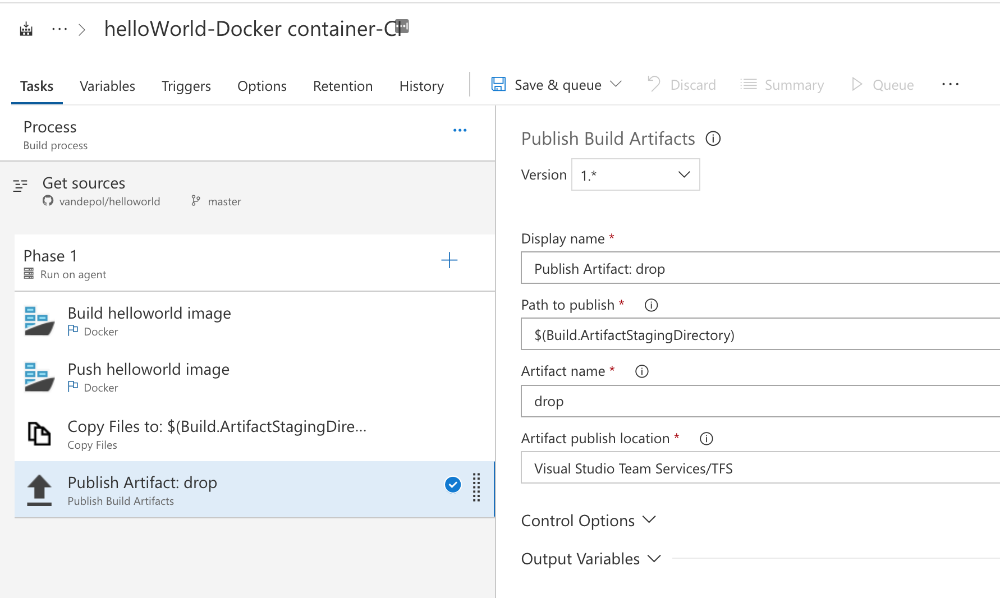


Next we try to build the image. Click Save & Queue
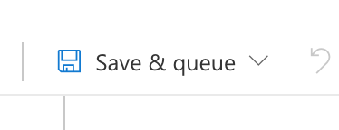


If successful you should see this image up on dockerhub.com

Login to view it: <https://hub.docker.com/r/vandepol/helloworld>

Now we're ready to push this to IBM Cloud Private

6) Publish image to IBM Cloud Private

This section assumes you have access to an IBM Cloud Private environment.  This also assumes it's accessible from VSTS, that is you don't need VPN or anything to connect.

First we have to create a deployment.yml file in the base of the github repository.  This script will define the deployment and service within kubernetes.

Here is the deployment.yml that I used, you must check this into github.
you can download this file here: <https://github.com/vandepol/sampleWebApp/blob/master/deployment.yml>

Notice we've parameterized the image: `#{IMAGETAG}#`

```YML

apiVersion: v1
kind: Service
metadata:
  name: helloworld
  labels:
    app: helloworld
spec:
  ports:
    - port: 80
  selector:
    app: helloworld
  type: NodePort

---
apiVersion: extensions/v1beta1
kind: Deployment
metadata:
  labels:
    app: helloworld
  name: helloworld
spec:
  replicas: 1
  template:
    metadata:
      labels:
        app: helloworld
    spec:
      containers:
      - image: #{IMAGETAG}#
        name: helloworld
        ports:
        - containerPort: 80
          protocol: TCP

```

- Next we check this into GIT.
`cd /Users/davidvandepol/Projects/helloWorld`
`git init`  
`git add .`  
`git commit -m "add ICP deployment"`  
`git remote add origin https://github.com/vandepol/helloworld`  
`git remote -v`   
`git push -u origin master`

- Go back to VSTS and re-run the build with the new file.

- Next we go to the Releases section in VSTS.
- Click `+ New definition`
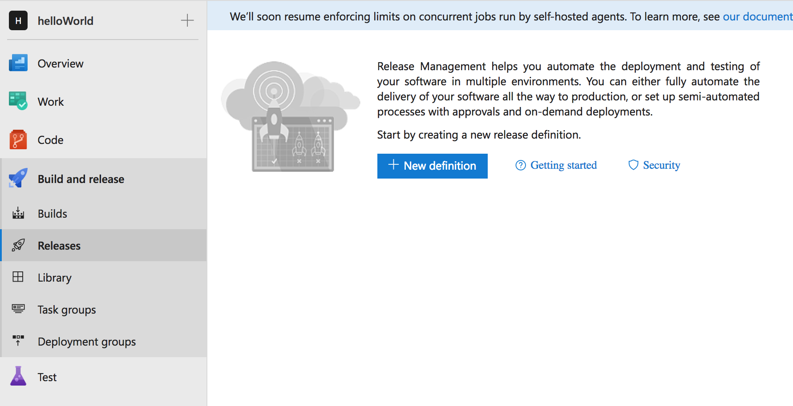

- When it asks to select a template, select `Deploy to a Kubernetes environment`
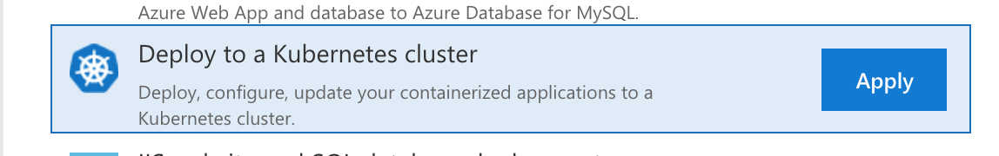

- Specify the following information
  - Environment name: IBM Cloud private
- Click on the Artifact and click Add.
- Select Source Type: Build.
  - Specify Project: helloworld
  - Source: helloWorld-Docker container-CI
  - Default version: Latest
  - Source alias: helloWorld_Alias
  - Click <b>Add</b>
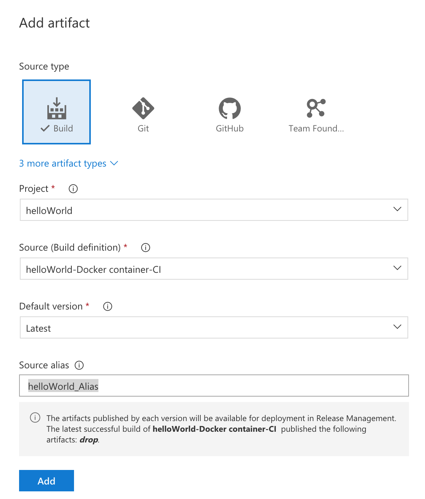

- Select the lightnight bolt above the artifact, and enable Continuous deployment trigger (This will kick off the release every time there is a successful build)

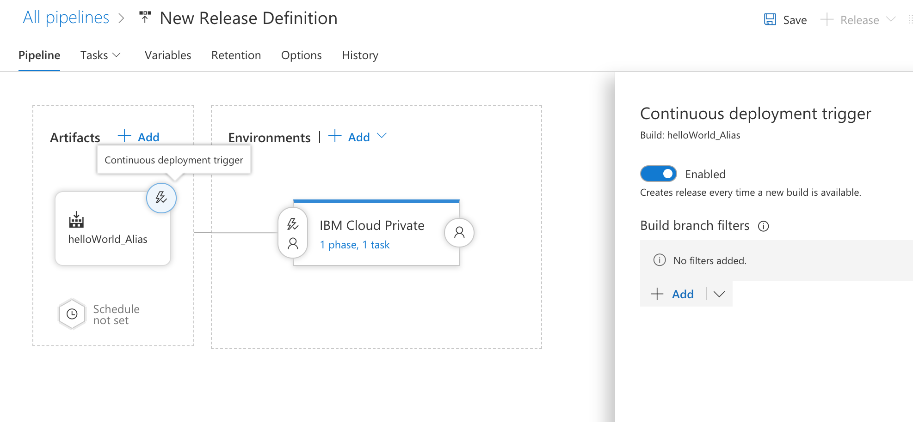

Click on the Tasks menu
Select the kubectl apply and modify the properties.
- Display name: `kubectl apply`
- Kubernetes service connection: Click `+ New`
  - Popup will appear
  - Choose Authorization: Kubeconfig (Note using Kubeconfig will have the token expire, for long term service account is suggested)
  - Connection name: IBM Cloud private
  - Server URL: `Your server URL  Typically https://ICPhostname:8001`
  - KubeConfig: your kube config file.  To get contents of this file follow these steps:
  https://github.ibm.com/vandepol/howto/blob/master/Kubernetes/KubeConfigFile.md
  - Accept Untrusted Certificates: `Checked`
  - Verify Connection.
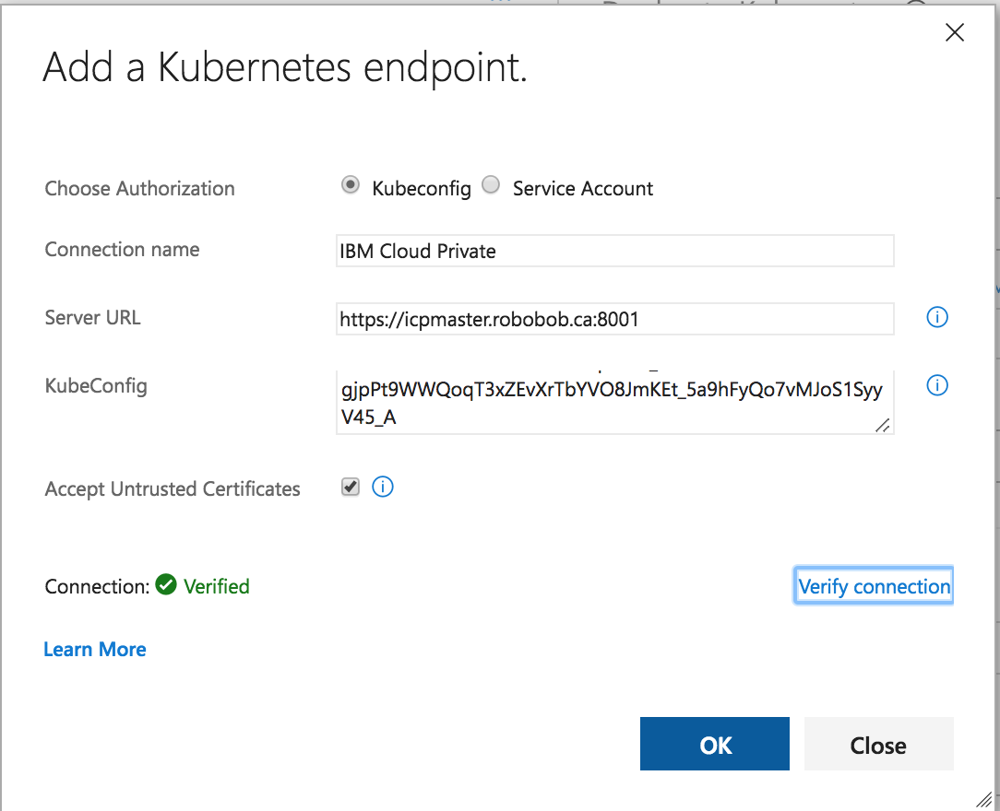

- NameSpace: `leave blank`
- Command: `apply`
- <b>Check</b> Use Configuration files
- Configuration file: `$(System.DefaultWorkingDirectory)/helloWorld_Alias/drop/helloWorld/deployment.yml`
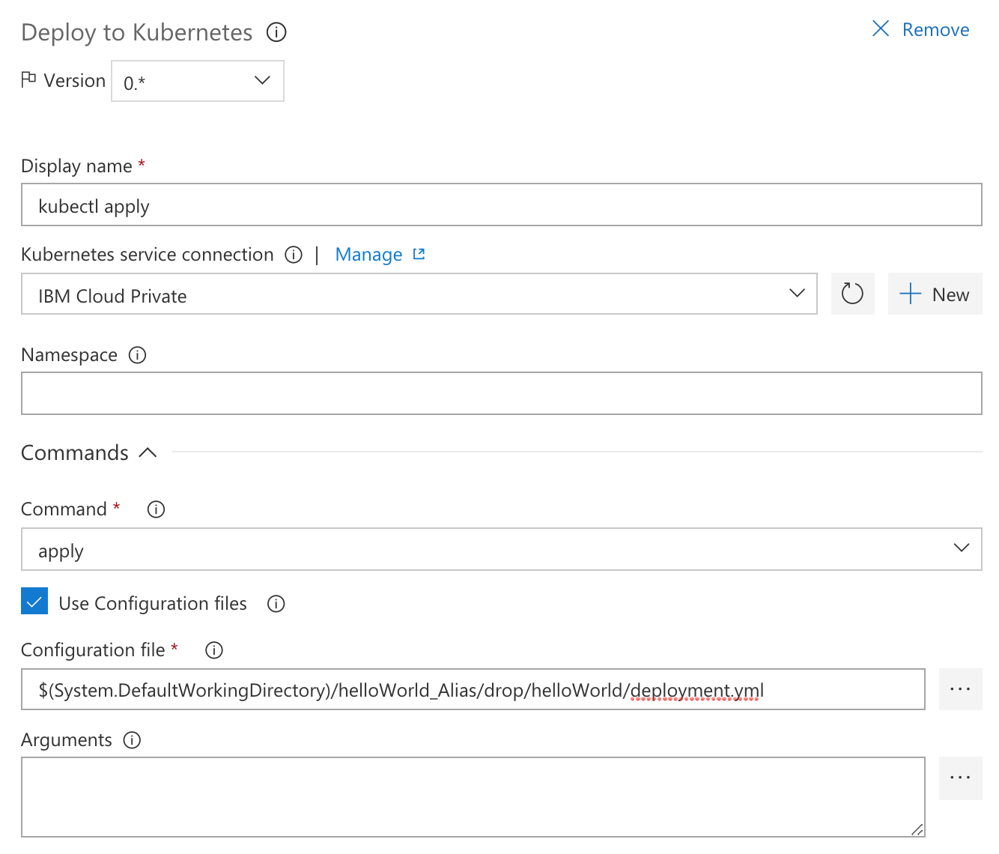


Next we need to define variables for the IMAGETAG
- On the top menu select <b>Variables</b>
- Select `+ Add`
- Name: `IMAGETAG`
- Value: `$(repoName)/samplewebapp:$(build.BuildId)`
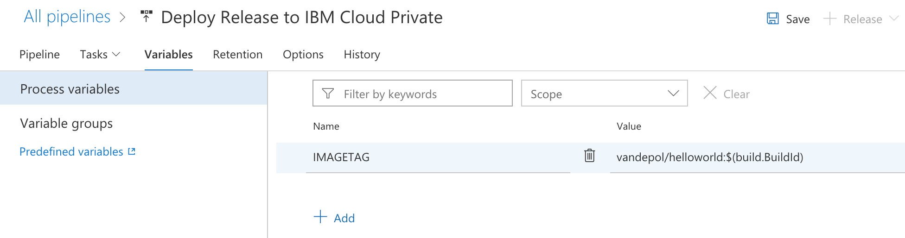


In the Task page, click the `+` next to Agent phase to add a new task.
- Select Replace Tokes (you may need to add from Marketplace).
- Move it to before teh kubectl apply task.
- Modify the properties as follows:
  - Display name: `Replace tokens in **/*.yml`
  - Root Directory: `Leave Blank`
  - Target files: `**/*.yml`
  - Use defaults for the rest
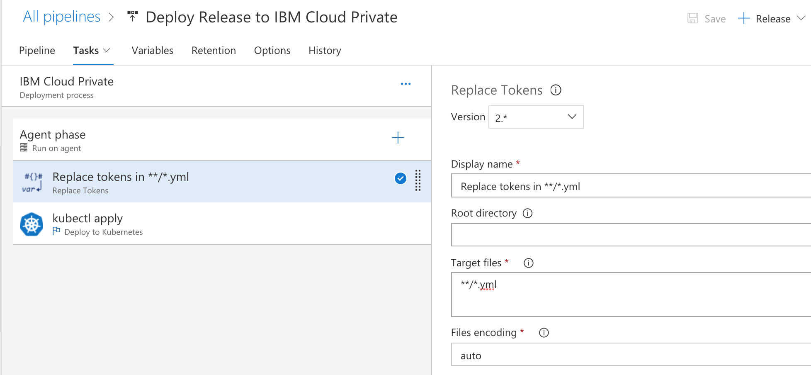

Now we manually deploy the release.
Click on Releases
Select Your release, and click `+ Release` then select `Create Release` from the drop down.
